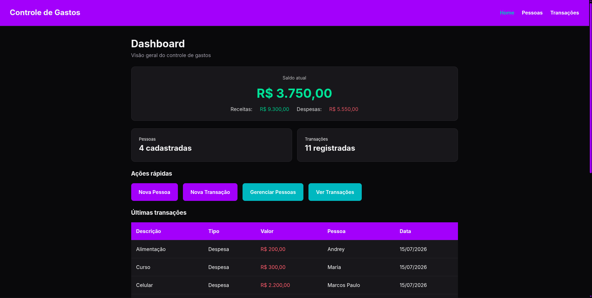
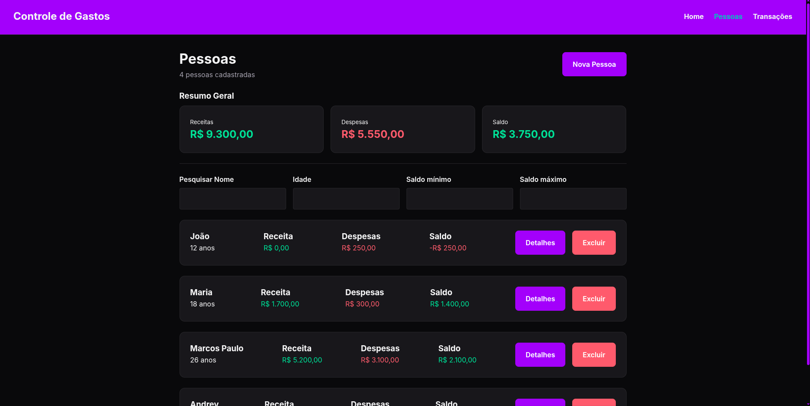
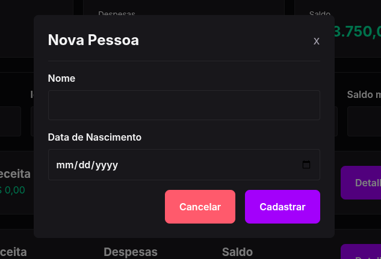
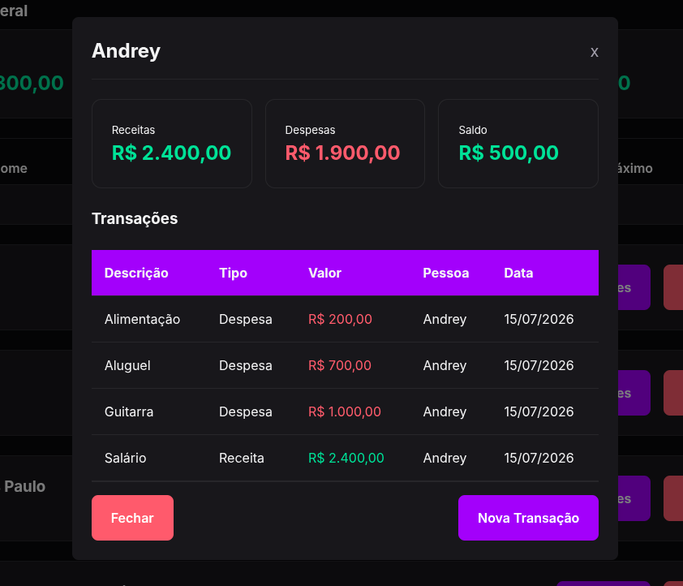
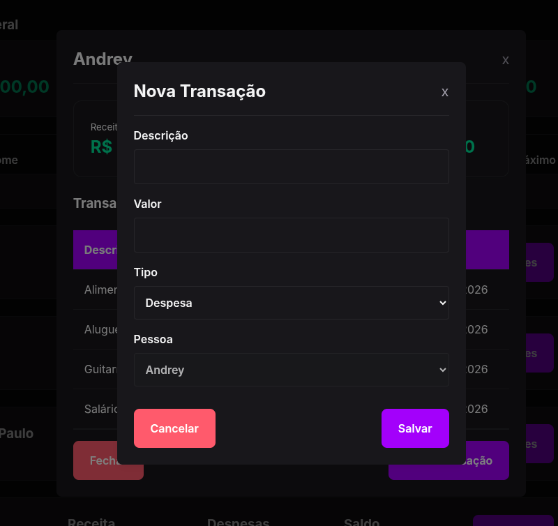
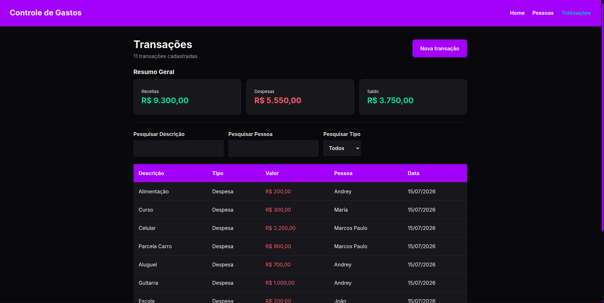
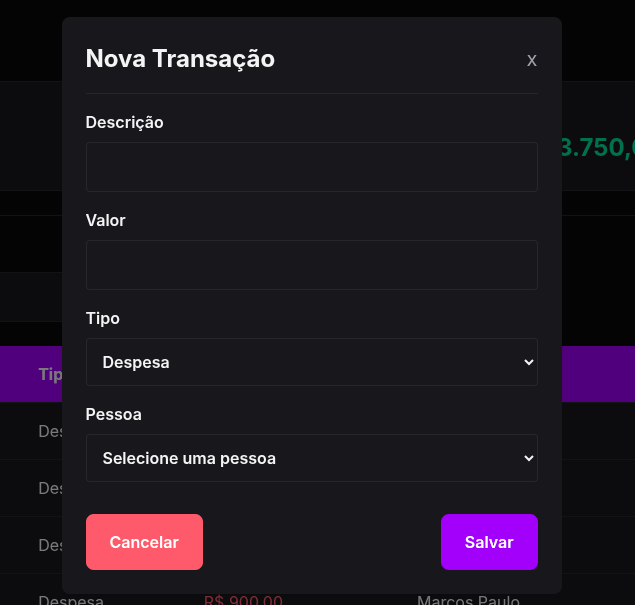

# Telas da Aplicação

A seguir estão algumas capturas de tela da interface da aplicação.

---

## Dashboard

Visão geral do sistema com resumo financeiro consolidado e ações rápidas.

---

## Pessoas

Tela de gerenciamento de pessoas cadastradas, com filtros, resumo financeiro individual e ações disponíveis.

---

## Cadastro de Pessoa

Modal para cadastro de uma nova pessoa.

---

## Detalhes da Pessoa

Resumo financeiro da pessoa selecionada e histórico de transações.

---

## Nova Transação (pela Pessoa)

Cadastro de uma nova transação diretamente pelos detalhes da pessoa.

---

## Transações

Tela para gerenciamento de todas as transações cadastradas com filtros e tabela de transações.

---

## Cadastro de Transação

Modal para cadastro de uma nova transação.

